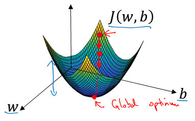
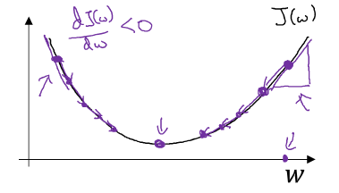
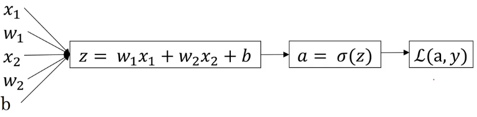
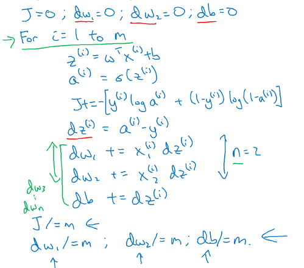

<script type="text/javascript" src="http://cdn.mathjax.org/mathjax/latest/MathJax.js?config=default"></script>
# Week 2
## Basics of Neural Network Programming
### 2.1 - binary classification

$m$ training example: $(x^{(1)}, y^{(1)}), \cdots, (x^{(m)}, y^{(m)})$
$$
X = 
\left[
\begin{matrix}
\vdots & \vdots & \cdots & \vdots \\
x^{(1)} & x^{(2)} & \cdots & x^{(m)} \\ 
\vdots & \vdots & \cdots & \vdots \\
\end{matrix}
\right], 
Y = 
\left[
\begin{matrix}
y^{(1)} & y^{(2)} & \cdots & y^{(m)} \\
\end{matrix}
\right]
$$

X.shape = (n_x, m), Y.shape = (1, m)

### 2.2 - logistic regression
This is a learning algorithm you use when the output label y in a supervised learning problem are all either 0 or 1, so for binary classification problem.
Given an input feature vector $x$ maybe corresponding to the image that you want to recognize either a cat picture or not a cat picture, you want the algorithm that can output a prediction, which we'll call $\hat{y}$, which is your estimate of $y$, you want the $\hat{y}$ to be the probability of the chance $P(y=1 | x)$, you want $\hat{y}$ to tell you, what is the chance that this is a cat picture. <font color = red>you want $\hat{y}$ to be the chance the y equal to 1</font>

$$\hat{y} = \theta(w^Tx+b) = \frac{1}{1 + e^{-(w^Tx + b)}}$$

When you implement your logistic regression, your job is try to learn the paramenter $W$ and $b$ so that $\hat{y}$ becomes a good estimator of the chance of $y$ equal to $1$. In order to train the $W$ and $b$, you need to defined a cost function.

### 2.3 - logistic regression cost funciton
Let's see what loss function or error function we can use to measure how well our algorithm is doing. 
One thing we can do is following: 

$$L(\hat{y}, y) = \frac12(\hat{y} - y)^2$$

It turn out that you could do this, but in logistic regression people don't usually do this, because when you come to learn your parameters, you find that the optimization problem becomes non-convex, which will be a problem with muliple local optima. So gradient desecnt may not find the global optimum. 
So what we use in the logistic regression is actually the following function.
$$L(\hat{y}, y) = -\bigg(ylog\hat{y} + (1-y)log(1-\hat{y})\bigg)$$
<font color = red>Here's some intuition for why this loss function make sence</font>
We want $L$ to be as small as possible. To understand why this make sence, let's look at the two cases. 

<ol>
 <li> if $y = 1 \longrightarrow L(\hat{y}, y) = -log\hat{y} \ \longrightarrow$ want $log\hat{y}$ large, because the $\hat{y}$ can never be bigger than 1, so you want $\hat{y}$ to be close to 1</li>
 <li> if $y = 0 \longrightarrow L(\hat{y}, y) = -log(1 - \hat{y}) \ \longrightarrow$ want $1 - \hat{y}$ large so that want $\hat{y}$ small, because $\hat{y}$ can never smaller than 0, so you want $\hat{y}$ to be close to 0, <font color = red>This is saying that if $y = 0$, your loss function will push the parameters to make the $\hat{y}$ as close to zero as possible</font></li>
</ol>

Cost funtion:
$$J(W, b) = \frac1m\sum_{j = 1}^{m}L(y^{(j)}, \hat{y}^{(j)})\tag1$$

It turns out that logistic regression can be viewed as a very very small neural network, Let's go on the next to see how we view the logistic regression as a very small neural network.

### 2.4 - gradient descent
Now let's talk about how you can use the gradient descent algorithem to train or learn the $W$ and $b$ on your training set. The cost function measures how well your parameters $W$ and $b$ are doing on the training set. What we want to do is really to find the value of $W$ and $b$ that corresponds to the minmum of the cost function $J(W, b)$. <font color = red>It turn out that the cost function J is a convex function, so just a single big bowl. (fig.1)</font>So the fact that our cost function $J(W, b)$ as defined here is convex is one of the huge reason why this particular cost functionn for logsitic regression. <font color = red>For logistic regression almost any initialization method works. </font>


\begin{aligned}
repeat \{& \\
& w := w - \alpha\frac{dJ(w)}{dw}\\
\}
\end{aligned}



I will repeatedly do that until the algorithm converges. Now <font color = red>let's just make sure that this gradient descent update make sense. (fig.2)</font>If we have started off with the large value of $w$, now the derivate is positive, and $w$ get updates as $w$ minus a learning rate times the poistive derivative, so you end up taking a step to the left. If we have started off the small value of $w$, now at the point the slope will be negative, and so the gradient descent updates would subtract $\alpha$ times a negative number, and so end up slowly increaseing $w$, so you end up making $w$ bigger and bigger. So that whether you initilize on the left or on the right, gradient descent updates will move you towards the global minmum point.

### 2.5 - derivatives
For a straight line which function is $f(a) = 3a$, the slope of this function $f(a)$ denote as $\frac{df(a)}{da}$, which equals to 3, this equation means that if we nudge $a$ to the right a little bit, $f(a)$ go up by 3 times as much as I nudge just the value of little $a$.

### 2.6 - more derivatives example
The derivative of the function just means the slope of the function, and the slope of function can be diffient at diffient point on the function. In our first example where $f(a) = 3a$, this is a straight line the derivative was the same everywhere, it's 3 everywhere. But for the function $f(a) = a^2$, the slope of the line vary, so the slope or the derivative can be diffierent at diffierent point on the curve. 

### 2.7 - computation graph

### 2.8 - derivatives with a computation graph

### 2.9 - logistic regression gradient descent (just one training example)
We will talk about how to compute derivatives for you to implement gradient descent for logistic regression. 

*focus on just one example:*
$$z = w^Tx + b$$
$$\hat{y} = a = \sigma(z)$$
$$L(\hat{y}, y) = -\big(yloga + (1 - y)log(1 - a)\big)$$

In logistic regression what we want to do is to modify the paramenters $w$ and $b$ in order to reduce the loss. We know how to compute the loss on a single training example. Now let's talk about how you can go backward to compute the derivatives.



$$da = \frac{dL(a, y)}{da} = -\frac{d}{da}\big(yloga + (1 - y)log(1 - a)\big) = -\frac{y}{a} + \frac{1-y}{1-a}$$
$$dz = \frac{dL(a, y)}{dz} = \frac{dL(a, y)}{da}\frac{da}{dz} = (-\frac{y}{a} + \frac{1-y}{1-a})(a(1 - a)) = \frac{-y(1-a) + a(1- y)}{a(1-a)}a(1-a) = a-y$$
where: $$a = \sigma(z) = \frac{1}{1+e^{-z}}$$
$$\frac{da}{dz} = \frac{e^{-z}}{(1+e^{-z})^2} = \frac{-1+1+e^{-z}}{(1+e^{-z})^2} = \big(\frac{-1}{(1+e^{-z})^2} + \frac{1}{1+e^{-z}}\big) = a - a^2 = a(1 - a)$$


$$dw_1 = \frac{dL}{dw_1} = \frac{dL}{dz}\frac{dz}{dw_1} = x_1dz$$
$$dw_2 = \frac{dL}{dw_2} = \frac{dL}{dz}\frac{dz}{dw2w} = x_2dz$$
$$db = \frac{dL}{db} = \frac{dL}{dz}\frac{dz}{db} = dz$$

so if you want to do gradient descent with respect to just one example. what you will do is following:
$$w_1 := w_1 - \alpha dw_1$$
$$w_2 := w_2 - \alpha dw_1$$
$$b := b - \alpha db$$
so this is one step with respect to single example, but to train logstic regression model you have not just one example.


### 2.10 - gradient descent on m examples
In the previous we saw how to compute derivatives and implements gradient descent with respect to just one training example for logistic regression, now we want to do it for $m$ examples. 

$$J(W, b) = \frac1m \sum_{i = 1}^{m}L(a^{(i)}, y^{(i)})$$
$$a^{(i)} = \sigma(z^{(i)}) = \sigma(w^Tx^{(i)} + b)$$

When just have one training example $(x^{(i)}, y^{(i)})$, we saw how to compute the derivatives $dw_1^{(i)}, dw_2^{(i)}$ and $db^{(i)}$.

<font color = red>The overall cost function was really the average of the individual losses, so the derivatives respect to $w_1$ of the cost function is also going to be the average of the derivatives respect to $w_1$ of the individual losses.</font>

$$\frac{\partial}{\partial w_1}J(W, b) = \frac1m \sum_{i = 1}^{m} \frac{\partial}{\partial w_1}L(a^{(i)}, y^{(i)})$$

one single step or one single iteration of the gradient descent for logistic regression
```python
J = 0; dw_1 = 0, dw_2 = 0, db = 0
for i in m:
    z^(i) = W^T x^(i) + b
    a^(i) = sigmoid(z^(i))
    J += -(y^(i) log(a^(i)) + (1-y^(i))log(1-a^(i)))
    dz^(i) = a^(i) - y^(i)
    dw_1 += x^(i)_(1) dz^(i)
    ...
    dw_n += x^(i)_(m) dz^(i)
    db += dz^(i)
J /= m
dw_1 /= m
dw_2 /= m
db /= m

w_1 = w_1 - alpha * dw_1
w_2 = w_2 - alpha * dw_2
...
b = b - alpha * db
```



Next let's talk about vectorization, so that you can implement a single iteration of gradient descent without use any for loop.

### 2.11 - vectorization


```python
import numpy as np
import time
a = np.random.rand(1000000)
b = np.random.rand(1000000)

tic = time.time()
c = np.dot(a, b)
toc = time.time()
print(c)
print('Vectorized  version ' + str(1000*(toc - tic)) + 'ms')

c = 0
tic = time.time()
for i in range(1000000):
    c += a[i]*b[i]
toc = time.time()
print(c)
print('for loop', str(1000*(toc - tic)), 'ms')
```

    249959.93156286428
    Vectorized  version 2.002239227294922ms
    249959.93156286076
    for loop 639.4250392913818 ms
    

### 2.12 - more vectorization examples

*************


### 2.13 - vectorizing logistic regression
We have talked about how vectorization let's you speed up your code significantly. Now we will talk about how we can vectorize the implementation of logistic regression, so you can process the entire training set, that is implement a single iteration of gradient descent with respect to an entire training set without useing even a single explicit for loop. 

$$z^{(1)} = W^Tx^{(1)} + b$$
$$a^{(1)} = \sigma(z^{(1)})$$
$$\vdots$$
$$z^{(m)} = W^Tx^{(m)} + b$$
$$a^{(m)} = \sigma(z^{(m)})$$

remember than we defined a matrix capital $X$ to be training input, stacked together in different columns. 

$$
X = 
\left[
\begin{matrix}
\vdots & \vdots & \cdots & \vdots \\
x^{(1)} & x^{(2)} & \cdots & x^{(m)} \\ 
\vdots & \vdots & \cdots & \vdots \\
\end{matrix}
\right]
$$

Next we will show how we can compute $z^{(1)}, z^{(2)}, \cdots, z^{(m)}$ all in one step, with one line code.
$$
Z = [z^{(1)}, z^{(2)}, \cdots, z^{(m)}] = [w_{1}, w_{2}, \cdots, w_{m}]
\left[
\begin{matrix}
\vdots & \vdots & \cdots & \vdots \\
x^{(1)} & x^{(2)} & \cdots & x^{(m)} \\ 
\vdots & \vdots & \cdots & \vdots \\
\end{matrix}
\right] + b
= [w^Tx^{(1)} + b, w^Tx^{(2)} + b, \cdots, w^Tx^{(m)} + b] = w^Tx
$$

```python
Z = np.dot(w.T, X) + b
A = sigmoid(Z)
```

### 2.14 - vectorizing logistic regression's gradient compute
You saw how use vectorization to compute their predictions for an entire training set all at the same time. Now you will to see how to use vectorization to also perform the gradient computations for all m training samples, again, all those at the same time. 


\begin{equation}
\left.
\begin{aligned}
& dz^{(1)} = a^{(1)} - y^{(1)} \\
& dz^{(2)} = a^{(2)} - y^{(2)} \\
& \cdots \\
& dz^{(m)} = a^{(m)} - y^{(m)} \\
\end{aligned}
\right\}
\longrightarrow dZ = [dz^{(1)}, dz^{(2)}, \cdots, dz^{(m)}] = A - Y
\end{equation}
$$$$


\begin{equation}
\left.
\begin{aligned}
db = 0 \\
db += dz^{(1)} \\
db += dz^{(2)} \\
\cdots \\
db += dz^{(m)} \\
\end{aligned}
\right\}
\longrightarrow db = \frac1m \sum_{i = 1}^{m} dz^{(i)}  = \frac{1}{m} np.sum(dZ)
\end{equation}


\begin{equation}
\left.
\begin{aligned}
dw = 0 \\
dw += x^{(1)}dz^{(1)} \\
dw += x^{(2)}dz^{(2)} \\
\cdots \\
dw += x^{(m)}dz^{(m)} \\
\end{aligned}
\right\}
\longrightarrow 
dw = \frac1m Xdz^T = \frac1m [x^{(1)}, x^{(2)}, \cdots, x^{(m)}]
\left[
\begin{aligned}
dz^{(1)} \\
\vdots \\
dz^{(m)}
\end{aligned}
\right]
\end{equation}

implement a iteration of gradient descent for logistic regression without useing a single FOR loop.
\begin{aligned}
& Z = w^TX + b\ (Z.shape() = (1, m))\\
& A = \sigma(Z) \\
& dZ = A - Y \\
& dw = \frac1m XdZ^T \\
& db = \frac1m np.sum(d Z) \\
& w = w - \alpha dw \\
& b = b - \alpha db \\
\end{aligned}

### 2.15 - boradcasting in python


```python
A = np.array([[56.0, 0.0, 4.4, 68.],
              [1.2, 104.0, 52.0, 8.0],
              [1.8, 135.0, 99.0, 0.9]])
print(A)
```

    [[ 56.    0.    4.4  68. ]
     [  1.2 104.   52.    8. ]
     [  1.8 135.   99.    0.9]]
    


```python
cal = A.sum(axis = 0) # you want to python to sum vertically
print(cal)
```

    [ 59.  239.  155.4  76.9]
    


```python
percentage = A/cal
print(percentage)
```

    [[0.94915254 0.         0.02831403 0.88426528]
     [0.02033898 0.43514644 0.33462033 0.10403121]
     [0.03050847 0.56485356 0.63706564 0.01170351]]
    

### 2.16 - a note on python or numpy vectors


```python
a = np.random.rand(10)
print(a)
```

    [0.13443415 0.4745017  0.57789331 0.86561381 0.58306069 0.7279712
     0.82406687 0.79017576 0.29791589 0.63532425]
    


```python
a.shape
```


    (10,)


This is called rank 1 array in python, and it's neither a row vector nor a colume vector.


```python
print(a.T)
```

    [0.13443415 0.4745017  0.57789331 0.86561381 0.58306069 0.7279712
     0.82406687 0.79017576 0.29791589 0.63532425]
    


```python
print(np.dot(a, a.T))
```

    3.992228908520009
    


```python
a = np.random.randn(5, 1)
print(a)
```

    [[-2.06169334]
     [ 1.11551267]
     [ 0.32999971]
     [ 0.52701914]
     [ 1.85713682]]
    


```python
print(a.shape)
```

    (5, 1)
    


```python
print(a.T)
```

    [[-2.06169334  1.11551267  0.32999971  0.52701914  1.85713682]]
    


```python
print(np.dot(a, a.T))
```

    [[ 4.25057943 -2.29984505 -0.6803582  -1.08655184 -3.82884662]
     [-2.29984505  1.24436853  0.36811886  0.58789653  2.07165966]
     [-0.6803582   0.36811886  0.10889981  0.17391616  0.61285461]
     [-1.08655184  0.58789653  0.17391616  0.27774917  0.97874664]
     [-3.82884662  2.07165966  0.61285461  0.97874664  3.44895718]]
    

So what I'am going to recommend is that when you doing your programming exercise, you just do not use these rank 1 array, instead, if every time you create an array, you commit to making it either a column vector or a row vector, these behavior of vector may be easier to understand. 

If you not very sure what's the dimension of one vector, you can often throw an assertion statement:
```python
assert(a.shape == (5, 1))
```

### 2.17 - explanation of logistic regression cost function
Why we use the cost function for logistic regression. 
$$\hat{y} = \sigma(w^Tx + b)$$

we said that we want to interpert $\hat{y}$ as the chance that $y = 1$ for given the set of input features $x$.
so another way to say this is that:
$$
\hat{y} = p(y = 1|x); 1 - \hat{y} = p(y = 0|x)
$$
or we can say:
\begin{aligned}
& if\ y = 1: p(y|x) = \hat{y} \\
& if\ y = 0: p(y|x) = 1 - \hat{y} \\
\end{aligned}

next what I'm going to do is take these two equations, which basically define $p(y|x)$ for two cases of $y = 0$ or $y = 1$, and summarize them into a single equation.
$$p(y|x) = \hat{y}^y(1 - \hat{y})^{(1-y)}$$
It's turn out that this one line summarize the two equations top. 

 - suppose $y = 1, p(y|x) = \hat{y} \centerdot (1 - \hat{y})^{0} = \hat{y}$
 - suppose $y = 0, p(y|x) = \hat{y}^0 \centerdot (1 - \hat{y})^{1 - 0} = 1 - \hat{y}$
 
because the log function is a strictly monotomically increaseing function, you're maximizing $log(p|x)$ give you similiar result that is optimizing $p(y|x)$.

$$logp(y|x) = log(\hat{y}^y(1 - \hat{y})^{(1-y)}) = ylog\hat{y} + (1 - y)log(1 - \hat{y}) = -L(\hat{y}, y)$$

we can carry out maximum likelihood estimation, so we want to find the parameters to maximizes the chance of you observation in the training set. 
$$log \prod_{i=1}^{m}p(y^{(i)}|x^{(i)}) = \sum^{m}_{i = 1}logp(y^{(i)}|x^{(i)}) = -\sum^{m}_{i = 1}L(y^{(i)}, y^{i})$$
